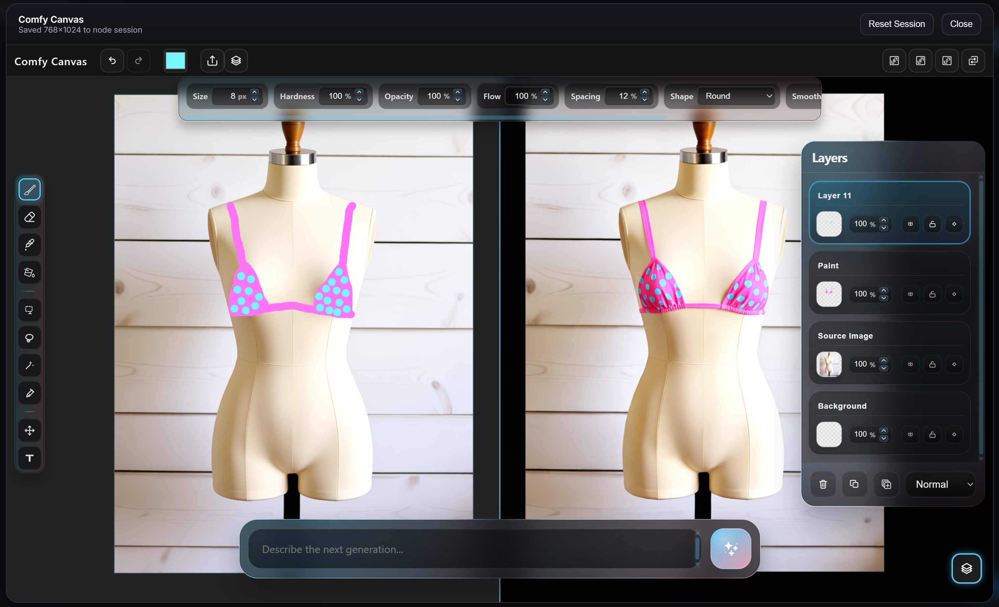
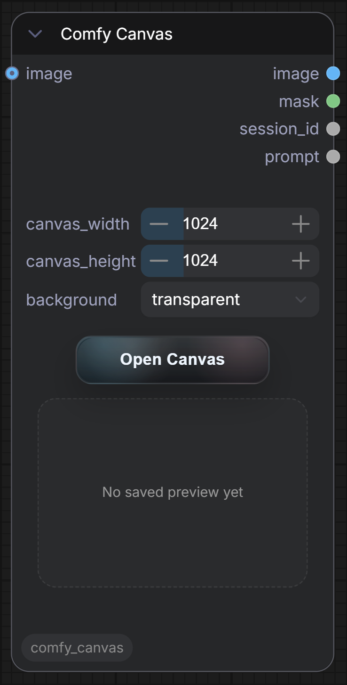
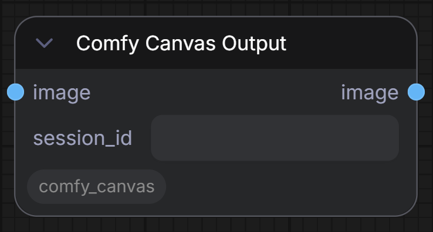
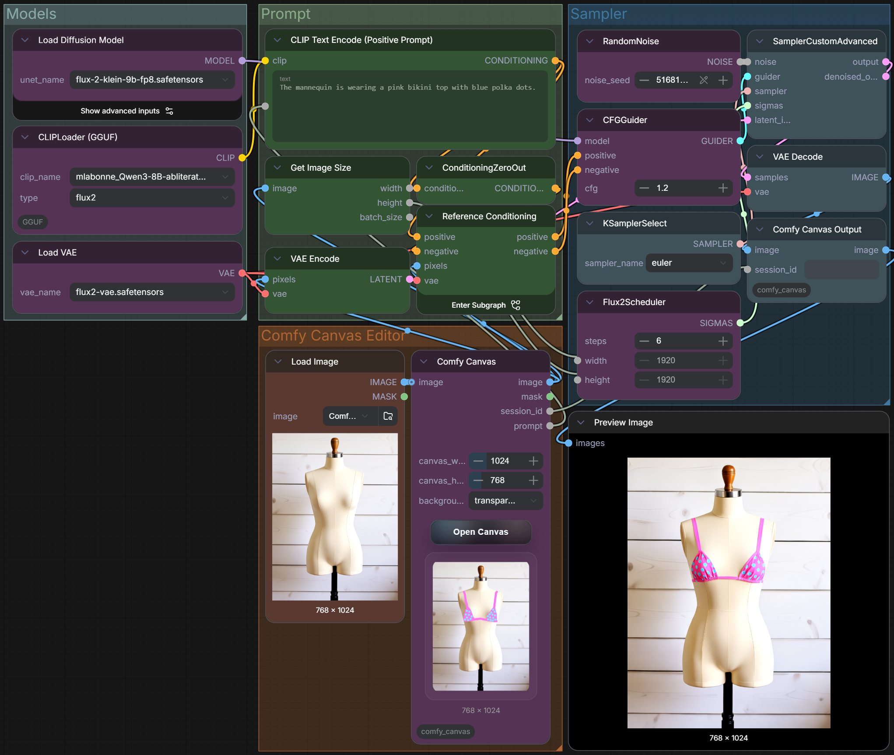

<p align="center">
  
</p>

# Comfy Canvas v1.0

Comfy Canvas is a ComfyUI-native layered editor that runs directly inside the ComfyUI tab.
It gives your workflow a persistent editing session, in-app painting and masking tools, prompt persistence, and a live round-trip path for reviewing the latest generated result without leaving ComfyUI.

**v1.0 is the release that moves Comfy Canvas fully local inside ComfyUI.**

Older builds relied on a separate side webapp and server workflow.
That is no longer the primary experience.

- No separate Flask server to launch
- No extra browser tab to keep open
- No split workflow between ComfyUI and a side app
- Everything now opens and runs from inside the ComfyUI tab itself

## What Changed in v1.0

Comfy Canvas now behaves like part of ComfyUI instead of a detached companion tool.

- The editor opens as an in-app overlay from the node
- Sessions stay attached to the node through `session_id`
- Layer data, prompt text, and editor state persist locally under ComfyUI user data
- Workflow outputs can be pushed back into the same session through `Comfy Canvas Output`
- The full paint -> run -> review -> continue loop happens in one place

If you used an older standalone or server-backed version, the key change is simple:
**Comfy Canvas now runs locally inside the ComfyUI tab.**

## Open to Opportunities in AI

I'm **Zlata Salyukova**, the developer behind Comfy Canvas.
My work focuses on building practical AI and creative tools across Python, JavaScript, and user-facing product design.

I'm open to opportunities in **AI** and **creative technology**.
You can reach me on X: [@Zlata_Salyukova](https://x.com/Zlata_Salyukova)

## Highlights

- Full editor overlay inside ComfyUI
- Persistent per-node sessions
- Layer stack persistence, not just a flattened PNG
- Non-destructive per-layer masks with thumbnail-based mask editing
- Brush, eraser, eyedropper, paint bucket, marquee, and move/transform tools
- Layer thumbnails, rename, duplicate, delete, opacity, blend modes, and drag reorder
- Prompt dock with prompt persistence and workflow run button
- Autosave during editing plus final save on close
- `IMAGE`, `MASK`, `session_id`, and `prompt` outputs from the main node
- Output preview loop through `Comfy Canvas Output`
- Copy Output workflow for bringing the latest generated result back into the canvas as a new layer
- Download the current right-pane output image directly from the editor

## UI Preview

<p align="center">
  
</p>

## Package Contents

This package registers two ComfyUI nodes:

- `Comfy Canvas`
- `Comfy Canvas Output`

It also serves the local web app from [`web/`](web/) through ComfyUI's `WEB_DIRECTORY` hook in [`__init__.py`](__init__.py).

The frontend is self-contained inside this repo, including a vendored PIXI runtime under [`web/app/vendor/`](web/app/vendor/), so it does not need a CDN or separate web service at runtime.

## Installation

1. Copy or clone this folder into `ComfyUI/custom_nodes/comfy_canvas`.
2. Restart ComfyUI.
3. Add `Comfy Canvas` to your graph.
4. Optionally add `Comfy Canvas Output` if you want the right pane to show the latest generated result from the workflow.

No separate server or standalone app process is required.

> Comfy Canvas targets current ComfyUI builds. If your installation is missing newer frontend or extension APIs, update ComfyUI before troubleshooting the custom node.

## License

Comfy Canvas is released under the MIT License. See [`LICENSE`](LICENSE).

Bundled third-party code keeps its own license notice:

- PIXI: [`web/app/vendor/PIXI_LICENSE.txt`](web/app/vendor/PIXI_LICENSE.txt)

## Quick Start

1. Add `Comfy Canvas` to your graph.
2. Optionally connect an input image if you want to begin from an existing image.
3. Add `Comfy Canvas Output` if you want the result preview loop.
4. Connect `Comfy Canvas.session_id` to `Comfy Canvas Output.session_id`.
5. Connect your final workflow image to `Comfy Canvas Output.image`.
6. Click `Open Canvas` on the node.
7. Paint, prompt, run the workflow, review the result, and continue editing in the same session.

## Recommended Graph Pattern

```text
Upstream image -> Comfy Canvas -> rest of workflow
Comfy Canvas.session_id -> Comfy Canvas Output.session_id
Final workflow image -> Comfy Canvas Output.image
```

This gives you:

- a stable session tied to the node
- a working editable document on the left pane
- the latest generated result on the right pane
- a fast edit-and-iterate loop without leaving ComfyUI

## Node Examples

<p align="center">
  
  
</p>

## Example Workflow

<p align="center">
  
</p>

[Download the example workflow JSON](./web/app/assets/Comfy_Canvas-Example_Workflow.json)

## Node Reference

### Comfy Canvas

Defined in [`comfy_canvas_node.py`](comfy_canvas_node.py).

Inputs:

- `session_id` (`STRING`)
- `canvas_width` (`INT`, default `1024`)
- `canvas_height` (`INT`, default `1024`)
- `background` (`transparent` or `white`)
- `image` (`IMAGE`, optional)

Outputs:

- `image` (`IMAGE`)
- `mask` (`MASK`)
- `session_id` (`STRING`)
- `prompt` (`STRING`)

Execution behavior:

1. If `edited.png` exists for the session, the saved edited image is returned.
2. Otherwise, if an input `image` is connected, that image is returned and seeded into the session as `seed.png`.
3. Otherwise, the node returns a blank document using the configured canvas size and background.

The `mask` output comes from the saved session mask when one exists.
If no saved mask exists, the mask is derived from the returned image alpha.

Current mask workflow:

- the node output mask is still created from the final visible canvas transparency
- opaque visible pixels in the edited image become black / `0` in the mask
- transparent pixels become white / `1` in the mask
- per-layer masks are now available in the editor and affect that final transparency non-destructively
- you can also still erase or delete pixels directly to create transparency
- for the most useful downstream mask output, start from a `transparent` canvas background
- if you use a `white` background and keep the final composite fully opaque, the mask output will also stay fully filled

The `prompt` output returns the latest prompt saved from the editor dock, so the text you queue from the canvas can be consumed by the rest of the workflow on that execution.

### Comfy Canvas Output

Defined in [`comfy_canvas_node.py`](comfy_canvas_node.py).

Inputs:

- `image` (`IMAGE`)
- `session_id` (`STRING`)

Outputs:

- `image` (`IMAGE`)

Behavior:

- saves the incoming image as `result.png` for the matching session
- updates session metadata with the result dimensions and timestamp
- returns the same image unchanged to the graph

Use the `session_id` output from `Comfy Canvas` as the `session_id` input to this node.

## Editor Workflow

The ComfyUI integration lives in [`web/js/comfyCanvasOverlay.js`](web/js/comfyCanvasOverlay.js). It:

- hides the raw `session_id` widget
- adds the `Open Canvas` button and node context-menu entry
- opens the editor in a modal iframe inside ComfyUI
- loads and saves the current session
- polls for updated workflow result images so the right pane stays current

Current overlay header actions:

- `Reset Session`
- `Close`

Saving is automatic:

- edits mark the session dirty immediately
- autosave is debounced to roughly 1 second after the last change
- closing the overlay forces a final save before dismissal

### Load Order

When the editor opens, it initializes in this order:

1. Saved session image, if one exists
2. Upstream preview image discovered from connected nodes
3. Blank document based on node width, height, and background

### Editor Features

The app code lives under [`web/app/`](web/app/).

Current feature set includes:

- layered compositing with per-layer opacity, visibility, and blend mode
- layer thumbnails, rename, duplicate, delete, and reorder handles
- per-layer masks with separate content and mask thumbnails
- brush and eraser with adjustable size, hardness, opacity, and flow
- eyedropper sampling from the visible composite
- paint bucket fill on the active layer
- marquee selection and move/scale/rotate transforms
- Select All and Ctrl/Cmd+click layer thumbnails create tight pixel selections instead of full-canvas boxes
- Photoshop-style text layers with double-click edit, placeholder text on new point-text boxes, point text auto-sizing, and optional fixed-width paragraph wrapping
- 20-step undo and redo history with stable pan/zoom framing
- upload image to a new layer
- copy current output preview to a new layer
- download the current output preview as a PNG from the editor top bar
- bottom prompt dock with prompt persistence and workflow run button
- fit editor, fit output, fit both, and pane swap controls

Tool shortcuts shown in the UI:

- `B`: Brush
- `E`: Eraser
- `I`: Eyedropper
- `G`: Paint bucket
- `M`: Marquee
- `L`: Lasso
- `W`: Magic Wand
- `P`: Pen
- `T`: Text
- Double-click existing text with the Text tool: Edit that text layer
- `V`: Move
- `F`: Fit both panes
- `[ / ]`: Decrease or increase brush / eraser size
- `Shift+[ / Shift+]`: Decrease or increase brush / eraser hardness
- `Ctrl/Cmd+A`: Select all opaque pixels on the active layer
- `Ctrl/Cmd+click` a layer thumbnail: Select that layer's opaque pixels
- `Ctrl/Cmd+D` or `Escape`: Clear the current selection
- `Delete` or `Backspace`: Delete the current selection contents
- `Enter` while editing point text: Commit text
- `Shift+Enter` while editing point text: Insert a new line
- `Ctrl/Cmd+Enter` while editing fixed-width text: Commit text
- `Enter` in the prompt dock: Run workflow
- `Shift+Enter` in the prompt dock: New line
- `Ctrl/Cmd+Z`: Undo
- `Ctrl/Cmd+Y` or `Ctrl/Cmd+Shift+Z`: Redo

Selection behavior:

- `Ctrl/Cmd+A` and `Ctrl/Cmd+click` on layer thumbnails build a real pixel mask from opaque pixels on that layer
- disconnected painted regions stay part of the same selection instead of collapsing to one rectangular box
- selected edge pixels stay with the floating selection cleanly when moving, scaling, or rotating

Layer mask behavior:

- click `+M` on a layer card to add a non-destructive mask to that layer
- click the main layer thumbnail to edit layer pixels
- click the smaller `M` thumbnail to edit that layer's mask
- while editing a mask, the editor locks to the Brush tool
- while editing a mask, the other paint/select/transform tools are temporarily disabled
- layer masks now use a Photoshop-style grayscale paint workflow
- paint with black to hide, white to reveal, and gray for partial transparency
- the top color picker is normalized to grayscale while editing a mask
- Shift+click the `M` thumbnail to disable or re-enable the mask without deleting it
- use the `M-` button in the layers footer to remove the selected layer mask completely
- mask thumbnails show the saved grayscale mask, while the main thumbnail shows the masked visible result

Mask output behavior:

- the node's `mask` output is based on transparency in the final edited image, not on a separate global output-mask channel
- erased or deleted areas on a transparent canvas become the mask output
- hidden areas created by per-layer masks also contribute to the mask output because they change the final composite alpha
- the saved session mask is generated from the editor composite's inverse alpha
- for best results, start with a `transparent` background when you plan to use the `mask` output downstream

Text tool behavior:

- clicking with the Text tool creates a new point-text layer with a visible `Type text` placeholder
- enabling `Fixed Width` switches the tool into paragraph-text mode and wraps lines inside the configured width
- double-clicking an existing text layer with the Text tool reopens it for editing
- while editing text, drag the text box by its border to reposition it without committing the edit
- pixel-edit tools rasterize a text layer automatically before direct paint, fill, or move-style pixel edits

Output preview behavior:

- the editor's download button saves the current right-pane output image, not the left editor canvas
- `Copy Output` pulls the current right-pane output into the layer stack as a new layer

Undo and redo behavior:

- the editor keeps up to 20 undoable edit steps
- redo can move forward to the latest state until a new edit creates a new history branch
- undo and redo restore canvas content without changing the current pan or zoom framing

## Session Storage

Session files are stored under ComfyUI's system user data directory:

```text
user/__comfy_canvas/sessions/<session_id>/
```

Possible files:

- `edited.png`
- `mask.png`
- `seed.png`
- `result.png`
- `metadata.json`
- `document.json`
- `layers/layer_####.png`
- `layers/layer_mask_####.png`

Session helpers are implemented in [`comfy_canvas_session.py`](comfy_canvas_session.py).

Important session details:

- `session_id` is normalized to alphanumeric, `_`, `-`, and `.` characters and truncated to 128 characters
- legacy sessions stored under `data/sessions/` are migrated on first access
- preview prefers `edited.png`, then falls back to `seed.png`
- reopening prefers `document.json` so the saved layer stack is restored before falling back to flat image files
- `Reset Session` deletes the full saved session directory
- the saved mask is generated from the editor composite's inverse alpha, so transparent or deleted pixels become the exported mask
- per-layer masks are stored separately inside `document.json` and `layers/layer_mask_####.png`, then reapplied when the layered document is reopened
- normal runtime use should not create session or cache files inside the `comfy_canvas/` repo folder itself

## Internal Routes

Custom routes are registered in [`comfy_canvas_routes.py`](comfy_canvas_routes.py):

- `GET /comfy_canvas/sessions/{session_id}`
- `POST /comfy_canvas/sessions/{session_id}`
- `POST /comfy_canvas/sessions/{session_id}/clear`
- `GET /comfy_canvas/sessions/{session_id}/document`
- `GET /comfy_canvas/sessions/{session_id}/image`
- `GET /comfy_canvas/sessions/{session_id}/mask`
- `GET /comfy_canvas/sessions/{session_id}/result`

These routes are internal to the ComfyUI extension and are used by the overlay for session load/save, preview image access, mask access, document restore, and result preview updates.

## Repo Layout

```text
comfy_canvas/
|-- .gitignore
|-- __init__.py
|-- LICENSE
|-- README.md
|-- comfy_canvas_node.py
|-- comfy_canvas_routes.py
|-- comfy_canvas_session.py
`-- web/
    |-- js/
    |   `-- comfyCanvasOverlay.js
    `-- app/
        |-- index.html
        |-- styles.css
        |-- assets/
        |   |-- Comfy_Canvas_Banner.png
        |   |-- Comfy_Canvas-UI.png
        |   |-- Comfy_Canvas-Canvas_Node.png
        |   |-- Comfy_Canvas-Output_Node.png
        |   |-- Comfy_Canvas-Workflow_Example(Flux2-Klein).png
        |   |-- Comfy_Canvas-Example_Workflow.json
        |   `-- icons/
        |       `-- sprite.svg
        |-- vendor/
        |   |-- pixi.min.mjs
        |   `-- PIXI_LICENSE.txt
        `-- src/
            |-- editor.js
            |-- layers.js
            |-- main.js
            |-- output.js
            `-- pixi.js
```

## Development Notes

- The web UI is a static app served by ComfyUI through `WEB_DIRECTORY`
- The overlay and editor communicate through a small iframe API exposed from [`web/app/src/main.js`](web/app/src/main.js)
- The canvas/editor implementation is PIXI-based
- PIXI is vendored locally under `web/app/vendor/`
- Session storage is file-based and local to the current ComfyUI installation/user profile
- The overlay does not run inference itself; generation still happens through the normal ComfyUI graph execution path

## Current Limitations

- Session data is stored locally on disk and is not designed as a multi-user shared service
- The right-pane preview depends on `Comfy Canvas Output` writing `result.png` for the same session
- This package is an editor/session layer, not a sampler or generation workflow by itself
- The node `mask` output is driven by final composite transparency rather than a separate standalone mask-output channel
- Older ComfyUI builds that lack the current extension/frontend APIs may need to be updated before Comfy Canvas will load correctly
