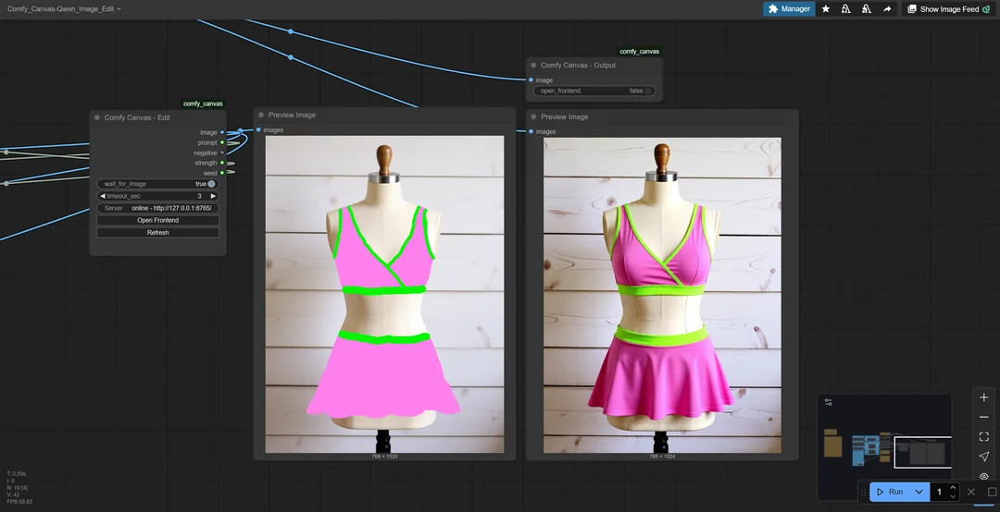

<p align="center">
  
</p>

# Comfy Canvas (Beta v0.1.1)

Comfy Canvas is a modern, multi-layer web canvas that bridges to ComfyUI via a lightweight Flask server. It ships two nodes to move images and text between your browser and a running ComfyUI workflow.

---

## Open to Opportunities in AI

I'm **Zlata Salyukova**, the developer behind Comfy Canvas. My work spans Python, JavaScript, Flask, and UI/UX design, with a background that combines technical problem-solving and hands-on project experience.

I'm interested in roles in the **AI and creative technology field**.
You can reach me on X: [@Zlata_Salyukova](https://x.com/Zlata_Salyukova)

---

## Demo Generation Video
Video Demo Link: https://x.com/i/status/1966235731363508601
<p align="center">
  
  
</p>

---

## What's New in v0.1.1
- Resolved ByteDance Seedream 4.0 outputs rendering in greyscale/scanlines by normalizing tensors and sending consistent PNG data from the output node.
- Bridge `/push/output` now rejects malformed base64 payloads so stale or partial frames never reach the canvas.

---

## Features

- Fast, multi-layer editor (PIXI.js) with brush, eraser, lasso, selection, blend modes, opacity, upload, and undo/redo
- Live input: send canvas + prompt/negative/strength/seed to ComfyUI
- Live output: stream result images back into the UI with consistent RGB encoding
- Auto-run (optional): bridge triggers ComfyUI's `/prompt` even if the ComfyUI tab is backgrounded
- Robust ComfyUI integration: auto-queue via UI API or direct `/prompt` with `client_id`, and optional base64 passthrough into the output node

---

## Node Overview

<div style="display: flex; align-items: flex-start; margin-bottom: 20px;">
  
  <div>
    <strong>Comfy Canvas - Edit (input node)</strong>
    <ul>
      <li>Outputs (IMAGE, STRING, STRING, FLOAT, INT)</li>
      <li>IMAGE: painted canvas</li>
      <li>STRING: prompt text</li>
      <li>STRING: negative prompt text</li>
      <li>FLOAT: strength (0..1, e.g., use as denoise strength)</li>
      <li>INT: seed (0..999999999999999)</li>
    </ul>
  </div>
</div>

<div style="display: flex; align-items: flex-start; margin-bottom: 20px;">
  
  <div>
    <strong>Comfy Canvas - Output (output node)</strong>
    <ul>
      <li>Accepts an IMAGE (or normalized base64 payload) and streams it back to the frontend for display</li>
    </ul>
  </div>
</div>

---

## Example Workflow using Qwen-Image-Edit
Connect the Comfy Canvas nodes to your own workflows as you like or start with my workflow to get started. (Image has workflow embedded - Drag and Drop into ComfyUI to get started.)
<p align="center">
  
</p>

---

## Installation

Prerequisites
- ComfyUI installed and running
- Python 3.10+

Install
- Place this folder at:
  - Windows: `<ComfyUI root>\comfyui\custom_nodes\comfy_canvas`
  - Linux/macOS: `<ComfyUI root>/comfyui/custom_nodes/comfy_canvas`
- Install dependencies:
  ```bash
  cd <ComfyUI root>/comfyui/custom_nodes/comfy_canvas
  pip install -r requirements.txt
  ```

Optional: use a virtual environment (recommended)
- Windows (PowerShell):
  ```powershell
  python -m venv .venv
  .\.venv\Scripts\Activate
  pip install -r requirements.txt
  ```
- Linux/macOS:
  ```bash
  python3 -m venv .venv
  source .venv/bin/activate
  pip install -r requirements.txt
  ```

---

## Quick Start

1. Start ComfyUI normally.
2. Start the Comfy Canvas bridge (separate terminal):
   - Windows (PowerShell):
     ```powershell
     cd <ComfyUI root>\comfyui\custom_nodes\comfy_canvas
     python cc_bridge_server.py
     ```
   - Linux/macOS:
     ```bash
     cd <ComfyUI root>/comfyui/custom_nodes/comfy_canvas
     python3 cc_bridge_server.py
     ```
   - Bridge serves the UI at `http://127.0.0.1:8765/` (configurable)
   - Stop the server: press Ctrl+C in that terminal, or POST `http://127.0.0.1:8765/shutdown`
3. In ComfyUI, add nodes:
   - "Comfy Canvas - Edit": wire `IMAGE` to your pipeline input (e.g., VAE encode)
   - Wire `prompt` to `CLIPTextEncode.text` and `negative` to your negative text input
   - Wire `seed` to your sampler seed; `strength` to a denoise/strength input (as desired)
   - "Comfy Canvas - Output": wire final `IMAGE` to stream the result back
4. Open the frontend: `http://127.0.0.1:8765/`
   - Paint on the left canvas, type a prompt, click Generate

Tip: The Edit node's right panel shows bridge status and can open the frontend.

---

## Configuration

Environment variables (set before starting the bridge):
- `CC_BRIDGE_PORT` – TCP port for the bridge (default: 8765)
- `CC_BRIDGE_HOST` – Host Comfy nodes use to reach the bridge (default: 127.0.0.1)
- `CC_FRONTEND_DIR` – Override path to the `frontend` folder (default: bundled)
- `COMFY_URL` – URL to the ComfyUI server (default: http://127.0.0.1:8188)
- `CC_AUTORUN` – If "1" (default), auto-trigger Comfy on Generate using a stored graph payload
- `CC_DUMP_OUTPUT` – When set (anything other than 0/false), writes every encoded PNG to `ComfyUI/user/cc_dump_result_*.png` for inspection

Legacy env vars (still supported): `LD_BRIDGE_PORT`, `LD_BRIDGE_HOST`, `LD_FRONTEND_DIR`.

---

## HTTP Endpoints (Bridge)

- `GET /status` – `{ ok, frontend_dir, url, has_input, has_output, generate_counter, ts }`
- `POST /push/input` – multipart form (`file`=PNG, `prompt`, `negative`, `strength`, `seed`) or JSON `{ png_base64, prompt, negative, strength, seed }`
- `GET /get/input` – image/png of last input (204 if none)
- `GET /get/prompt` – `{ prompt, negative, strength, seed }` (204 if none)
- `POST /push/output` – multipart form `file` or JSON `{ png_base64 }`
- `GET /get/output` – image/png of last output (204 if none)
- `POST /store/trigger` – `{ prompt: { prompt: <graphNodes>, client_id?: <id> } }` (stores payload for autorun)
- `POST /trigger` – `{ prompt }` (or uses stored payload) → forwards to `${COMFY_URL}/prompt`
- `POST /shutdown` – stops the bridge (for local/dev use)

Quick test:
```bash
curl http://127.0.0.1:8765/status
```

---

## Notes & Tips

- Auto-run: The ComfyUI sidebar extension publishes your current graph to the bridge; the bridge can then POST `/prompt` after a Generate, even if the ComfyUI tab is backgrounded.
- Bridge origin override in ComfyUI: in browser console, you can set the bridge URL if you changed the port/host:
  ```js
  localStorage.setItem('cc_bridge_origin', 'http://127.0.0.1:8765')
  location.reload()
  ```

---

## Troubleshooting

- Bridge shows offline in the node panel
  - Ensure it is running on the expected port; confirm `/status` is reachable
- Frontend does not open or icons missing
  - Confirm the bridge is serving static assets from the expected `frontend` directory
- Generate does not queue a run
  - Ensure the "Comfy Canvas - Edit" panel was loaded at least once (so the graph payload is stored)
  - Set `cc_bridge_origin` in ComfyUI localStorage if you changed the bridge URL
  - Call `GET /status` (generate_counter should increment) and confirm the sidebar extension has posted the latest graph via `POST /store/trigger`
- Output does not appear
  - Verify your pipeline wires the final image into "Comfy Canvas - Output"
  - Confirm `/get/output` returns 200 after a run
- Bridge will not start
  - Check if port 8765 is in use, or set `CC_BRIDGE_PORT`
  - Ensure dependencies are installed (`pip install -r requirements.txt`)
  - Check terminal output for errors

---

## To-Do

- [x] Release (Beta v0.1.0)
- [x] Patch v0.1.1 (Seedream output fix)
- [ ] Improve move, rotate, & translate functions
- [ ] Better selection functions (Marquee, Lasso)
- [ ] Rework (prompt options panel) layout/responsiveness
- [ ] **Bug** - "layer panel doesn't set layer image after new image is uploaded while in the move tool. Pressing new layer sets image to its layer."
- [ ] Fix Bugs...

### Suggestions & Features to Think About?

- Try a vector based drawing system?
  - "I will think about this but leaning toward no since we already have layers."
- Want: ctrl + click layer thumbnail to select layer pixels.
  - "Will be trying to figure this out"

---

## Version Changelog
See the full list of version changes in the [CHANGELOG.md](./CHANGELOG.md).

---

## Credits

This project was made possible with the help of the following tools:

- **GPT-5**
- **Codex**
- **Cursor**
- **Qoder**

---

## License

Licensed under the MIT License. See the `LICENSE` file for details.
